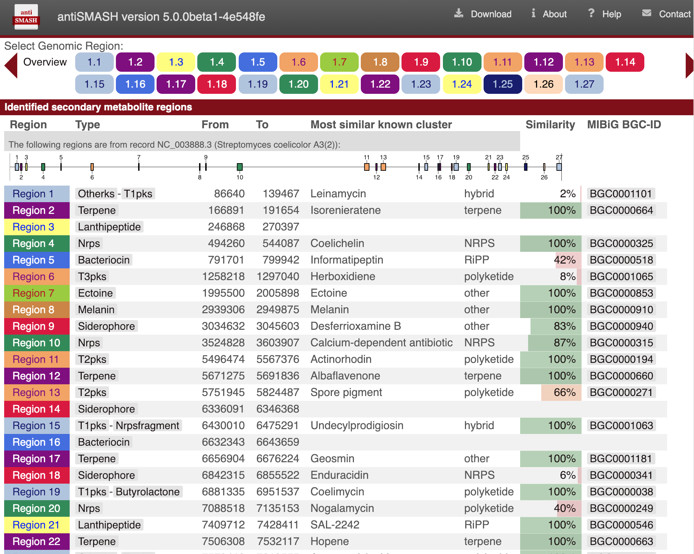
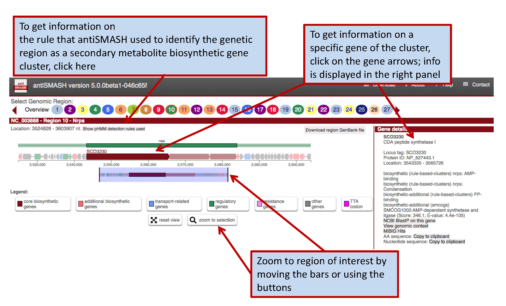
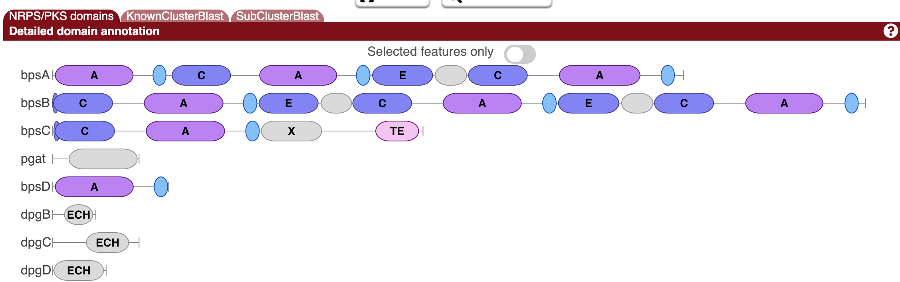
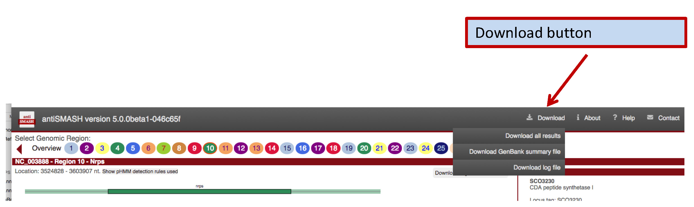

antiSMASH output
----------------

## Region overview page

The output of the antiSMASH analysis pipeline is organized in an interactive
HTML page and different parts of the analysis are displayed
in different panels for every gene cluster 



Initially, a list of identified regions (containing the clusters) is displayed in the results page. A region can be selected for viewing by clicking its number (gene clusters
are numbered in the order in which they appear on the input nucleotide sequence, starting from 1 for each record in the uploaded data)
in the "identified secondary metabolite regions" panel just below the top banner or by clicking on the colored "Cluster X.YY" boxes. A click on "Overview" brings you back to the
overview list.  Gene cluster buttons are color coded by predicted secondary
metabolite type.

## The antiSMASH 5 region concept

Currently, there is no good method available to accurately predict gene cluster borders purely based on the submitted sequence data (with exception with the CASSIS algorithm that can detect co-regulated genes in fungal genomes – however CASSIS doesn’t work in prokaryotes)
Therefore, antiSMASH5 changed the way gene clusters are displayed – to reflect the fact that the BGC borders are just offsets defined in the cluster detection rules we renamed the highest level that is displayed to “Region”. 

A “Region” in antiSMASH 5 corresponds to the “Gene Cluster” annotation in antiSMASH 4 and below.
How are antiSMASH 5 regions defined?
In the first step, all gene products of the analyzed sequence are searched against a database of highly conserved enzyme HMM profiles (core-enzymes), which are indicative of a specific BGC type.
In a second step, pre-defined cluster rules are employed to define individual “Clusters” encoded in the Region.
As an example an excerpt of the cluster rules to detect type I PKS:


Whenever antiSMASH finds a gene coding for a protein that has as PKS AT domain and a PKS KS domain of various sub-types, antiSMASH, a new “Type I PKS Cluster” feature is generated within the region; this feature comprises the core gene-product(s) that trigger the rule (i.e. the PKS encoding genes and extends to the left and right of the core genes by 20 kb to the left and right (as defined by the EXTENT parameter in the rule definition). The values for the different cluster types are empirically determined and generally tend to rather overpredict, i.e. included also adjacent genes.
After the “Cluster” features are assigned (note: there can be multiple cluster features in a region!!), they are checked for overlaps (as defined by the CUTOFF parameter) and are grouped into several types of “Supercluster” to reflect the observation that many BGCs actually comprise several classes of biosynthetic machinery. For example Glycopeptides like vancomycin or balhimycin (shown) are synthesized via NRPS, but also contain a type III PKS as a precursor pathway.


Thus, the displayed region contains the “nrps-cluster” (green bar) and a “type III PKS cluster” yellow bar. As their extents overlap, they are assigned to *Candidate Clusters*.

###There are different types of Candidate Clusteters:

```
chemical hybrid:
contains clusters which share Cluster-defining CDSFeatures, will also include clusters within that shared range that do not share a CDS provided that they are completely contained within the supercluster border, e.g.
       ---##A###############C#---   <- Cluster 1 with definition CDSes A and C
        --##A##--                   <- Cluster 2 with definition CDS A
                 --#B#--            <- Cluster 3 with definition CDS B
                         --#C#--    <- Cluster 4 with definition CDS C
                              -#D#- <- Cluster 5 with definition CDS D
Since clusters 1 and 2 share a CDS that defines those clusters, a chemical hybrid supercluster exists. Clusters 1 and 4 also share a defining CDS, so the hybrid supercluster now contains clusters 1, 2 and 4.

Cluster 3 does not share a defining CDS with either cluster 1, 2 or 4, but because it is interleaved into a chemical hybrid it is included under the assumption that it is relevant to the other clusters. 

interleaved:
contains clusters which do not share Cluster-defining CDS features, but their core locations overlap, e.g.
       ---#A###A###A---      <- Cluster 1 with defining CDSes marked A
          ---B##B####B---    <- Cluster 2 with defining CDSes marked B
                 ---C###C--- <- Cluster 3 with defining CDSes marked C
Since none of the clusters share any defining CDS with any other cluster, it is not a chemical hybrid. All three clusters would be part of an interleaved supercluster, since A overlaps with B and B overlaps with C.

 
neighbouring:
contains clusters which transitively overlap in their neighbourhoods  (the '-' sections in the examples above). In the chemical hybrid example, as all clusters overlap in some way, all 5 would be part of a neighbouring supercluster (with clusters 1-4 also being part of a hybrid supercluster). Every cluster in a 'neighbouring' cluster will also belong to one of the other kinds of supercluster.

single:
the kind for all "Candidate Clusters" where only one cluster is contained, only exists for consistency of access. A 'single' supercluster will not exist for a cluster which is contained in either a chemical hybrid or an interleaved "Candidate Cluster". In the chemical hybrid example, only cluster 5 would be in a 'single' supercluster as well as in the 'neighbouring' "Candidate Cluster".

```

## Region Results page



In the upper panel, "Gene cluster description", information is given about each
gene cluster that was detected. In the upper line, the biosynthetic type and
location of the gene cluster are displayed. Underneath this title line, all
genes present in a detected gene cluster are outlined. The borders of the gene
clusters have been estimated using different greedily chosen cut-offs specified
per gene cluster type.  Genes are color coded by predicted function. Putative
biosynthetic genes are colored red, transport-related genes are colored blue,
and regulation-related genes are colored green. These predictions depend on the
smCOG functionality an will be missing if you chose to not run smCOG
predictions.  Hovering over a gene with the mouse will prompt the gene name to
be displayed above the gene. 

### Gene details


Clicking the gene will provide more information on
the gene: its annotation, its smCOG (secondary metabolism gene family), its
location, and cross-links specific to that gene.

### Detailed annotation for PKS/NRPS domains




In the middle panel, "Detailed annotation", you can find more in-depth
information on the selected gene cluster.  For predicted modular polyketide
synthase (PKS) and/or nonribosomal peptide synthetase (NRPS) proteins, you will
find the domain annotation. 

Clicking on a domain image will prompt more
information to be displayed, such as the name of the detected domain, its
precise location, any substrate specificites predicted, and a link to run Blast
on the domain.  For predicted Lantipeptide clusters, the predicted core peptide
sequences of all identified prepeptides is displayed.
A list of detected domains can be found [here](modules/nrps_pks_domains.md).

### Identifying similar BGCs

The folder. "Homologous gene clusters", displays the top ten gene clusters
from the internal antiSMASH database that are most similar to a detected gene
cluster, visually aligned to it. The drop-down selection menu can be used to
browse through the gene clusters. Genes with the same colour are putative
homologs based on significant Blast hits between them.
Similar information is provided in the "KnownCluserBlast folder", which detects BGCs included in the curated MIBiG dataset. "SubClusterBlast" provides information about conserved operons, which, for example are involved in precursor biosynthesis of non-proteinogenic amino acids.

### Prediction of putative core sturctures


In the upper side panel
on the right. "Predicted core structure", a rough prediction of the overall
chemical structure of a the product of a detected nonribosomal peptide or
polyketide biosynthesis gene cluster is given. The second folder "PKS/NRPS monomers" displays detailed predictions for
all monomers.  Prediction details are available for multiple methods.

*PKS type I AT domain specificities are predicted using a twenty-four amino acid signature sequence of the active site (Yadav et al., 2003), as well as with pHMMs based on the method of Minowa et al. (Minowa et al., 2007), which is also used to predict co-enzyme A ligase domain specificities. NRPS A domain specificities are predicted using both the signature sequence method and the support-vector machines-based method of NRPSPredictor2 (Rausch et al., 2005 & Röttig et al., 2011), and the method of Minowa et al. (Minowa et al., 2007). Ketoreductase domain-based stereochemistry predictions for PKSs (Starcevic et al., 2008) are also performed.*

*For PKS type II clusters, the side panel shows a list of the predicted starter units along with bitscores, a list of the predicted number of malonyl elongations along with bitscores, the predicted product class, a list of product molecular weights predictions for each combination of starter unit and number of malonyl elongations. Furhtermore, it displays each gene/protein which are involved in the polyketide biosynthesis of the cluster. For each gene/protein the type is indicated and for some a prediction of function is displayed. More details on the predictions can be found [here](modules/t2pks.md).*


### Downloading results



In the upper right, a small list of buttons offers further functionality. The
question-mark button will get you to this help page. The exclamation-mark button
leads to a page explaining about antiSMASH. The downward-pointing arrow will
open a menu offering to download the complete set of results from the antiSMASH
run, a summary EMBL/GenBank output file or a log file for debug purposes. The
EMBL/GenBank file can be viewed in a genome browser such as Artemis.

**Results are kept on the public webserver for ONE month and will be deleted afterwards. Therefore it is highly recommended to download the full result set!**
